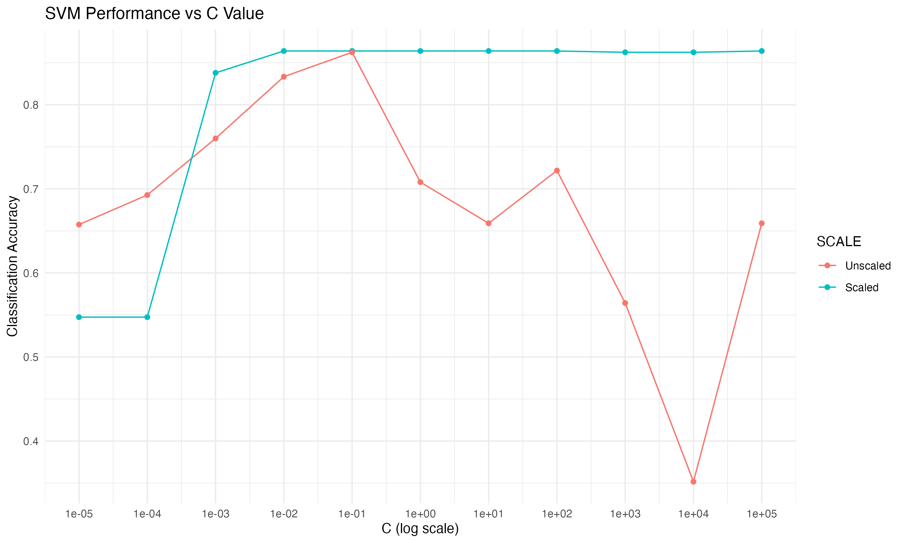
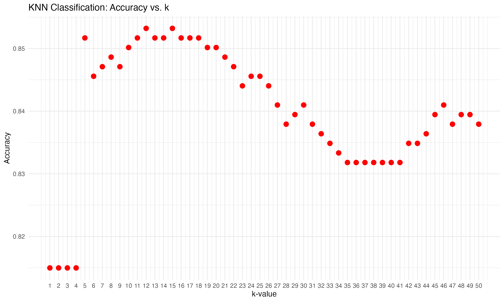

```{r setup, include=FALSE, message=FALSE, warning=FALSE}
knitr::opts_chunk$set(echo = TRUE)
```

# Question 2.1

### Prompt

**Describe a situation or problem from your job, everyday life, current events, etc., for which a classification model would be appropriate. List some (up to 5) predictors that you might use.**

### Solution

Considering American football (i.e. National Football League, NFL), a classification model would be appropriate for determining the type of offensive play that will be run.
In this instance, the binary classification problem is important for a defensive coordinator as the ability to determine whether the play will be a run or pass provides strategic insight for their own play of choice to stop the offense. This would allow for the defensive side of the team to anticipate upcoming plays more effectively. 
Classification of type of play could help coaches make real-time decisions for their own defensive formations. 
This could also be used in pre-game or post-game to identify offensive strategies based upon patterns.

Predictors for the classification model that would be appropriate include:

- Formations: The alignment of offensive players prior to the snap can provide insight on whether it is a run or pass play.
- Down and distance: Depending on the current down (4 downs total) and yards to achieve a first down, the play selection may be influenced.
- Player personnel: Different players are utilized based on their skillsets. Depending on the personnel on the field could indicate the play type.
- Field position: Depending on where the team is on the field may influence their choice on run or pass plays.
- Game situation: Depending on the score and time remaining, a team could be likely to run the ball to make time expire or pass the ball in an effort to even the score quickly.

In order to evaluate this problem, historical play-by-play data from games can be used for run and pass plays that include predictor variables. 
This approach is not novel, as it has been discussed by several references such as previous literature [@joash2020predicting].
This study shows the large amount of data to consider, using data from 2013-2014 and 2016-2017 totalling 130,244 pass/rush plays.

\newpage
# Question 2.2

The files `credit_card_data.txt` (without headers) and `credit_card_data-headers.txt` (with headers) contain a dataset with 654 data points, 6 continuous and 4 binary predictor variables.  It has anonymized credit card applications with a binary response variable (last column) indicating if the application was positive or negative. The dataset is the “Credit Approval Data Set” from the UCI Machine Learning Repository (https://archive.ics.uci.edu/ml/datasets/Credit+Approval) without the categorical variables and without data points that have missing values.

## 2.2.1. Support Vector Machine Classifiers

### Prompt

Using the support vector machine function `ksvm` contained in the R package `kernlab`, find a good classifier for this data. Show the equation of your classifier, and how well it classifies the data points in the full data set.  (Don’t worry about test/validation data yet; we’ll cover that topic soon.)

Notes on `ksvm`:

- You can use `scaled=TRUE` to get `ksvm` to scale the data as part of calculating a classifier.
- The term $\lambda$ we used in the SVM lesson to trade off the two components of correctness and margin is called C in `ksvm`.  One of the challenges of this homework is to find a value of C that works well; for many values of C, almost all predictions will be “yes” or almost all predictions will be “no”.
- `ksvm` does not directly return the coefficients a0 and a1…am.  Instead, you need to do the last step of the calculation yourself.  Here’s an example of the steps to take (assuming your data is stored in a matrix called data):[^1]

[^1]: I know I said I wouldn’t give you exact R code to copy, because I want you to learn for yourself.  In general, that’s definitely true – but in this case, because it’s your first R assignment and because the ksvm function leaves you in the middle of a mathematical calculation that we haven’t gotten into in this course, I’m giving you the code.

```
# call ksvm.  Vanilladot is a simple linear kernel.
model <- ksvm(data[,1:10],data[,11],type="C-svc",kernel="vanilladot",C=100,scaled=TRUE)
# calculate a1…am
a <- colSums(model@xmatrix[[1]] * model@coef[[1]])
a
# calculate a0
a0 <- -model@b
a0
# see what the model predicts
pred <- predict(model,data[,1:10])
pred
# see what fraction of the model’s predictions match the actual classification
sum(pred == data[,11]) / nrow(data)
```

Hint: You might want to view the predictions your model makes; if C is too large or too small, they’ll almost all be the same (all zero or all one) and the predictive value of the model will be poor.  Even finding the right order of magnitude for C might take a little trial-and-error.

**Note**: If you get the error "`Error in vanilladot(length = 4, lambda = 0.5) : unused arguments (length = 4, lambda = 0.5)`", **it means you need to convert** `data` **into matrix format:**

```
model <- ksvm(as.matrix(data[,1:10]),as.factor(data[,11]),
              type="C-svc",kernel="vanilladot",C=100,scaled=TRUE)
```

### Solution

For C classification, `C-svc` is utilized with the `vanilladot` linear kernel for simplicity. 
The model was ran with varied values of different orders of magnitude for `C` from 1E-5 to 1E5. 
In addition, `ksvm` was considered with and without scaling for a comparison of accuracy.
For `C=0.1`, the highest accuracies were recorded for both scaled and unscaled models. 
For unscaled models, there was only one optimal value for highest accuracy for `C`.
It should be noted, however, that for scaled models the accuracy was the same for several `C` values (`1e-2, 1e-1, 1, 1e1, 1e2`).
For simplicity, this section will go through the a model using `scaled=TRUE` and `C=0.1`, and later will display the full code to show the optimal `C` values.
First, the `kernlab` library is loaded to use `ksvm` and the data is imported, shown below. 

```{r, message=FALSE}
# Load the kernlab package - ksvm
library(kernlab)

# Set the working directory
setwd("~/projects/ISYE6501/HW1-SVM")

# Read txt file
data <- read.table("data/credit_card_data.txt", stringsAsFactors = FALSE, header = FALSE)

# Show the first 10 rows of data
head(data, 10)
```

Next, we prepare the data to ensure that the target variable, `R1`, is a factor. 
Once the data is prepared, the scaled model is created with `ksvm` using `type="C-svc"` and the `vanilladot` linear kernel.
General information about the model is printed after computing.

```{r, message=FALSE}

# Ensure the target variable is a factor
data[, 11] <- as.factor(data[, 11])  # Assuming R1 is the 11th column

# Create an SVM model w/ scaling
model_scaled <- ksvm(V11~., data=data, type = "C-svc", kernel = "vanilladot", C = 0.1, scaled = TRUE)

# Print the model information
print(model_scaled)
```

To calculate the coefficients $a_1 ... a_m$ we perform the following:

```{r, message=FALSE}
# Calculate the coefficients a_1 to a_m
a_scaled <- colSums(model_scaled@xmatrix[[1]] * model_scaled@coef[[1]])
print(a_scaled)
```

To calculate $a_0$ the model value for $b$ is utilized.

```{r, message=FALSE}
# Calculate a0, which is -model@b
a0_scaled <- -model_scaled@b
print(a0_scaled)
```

With the coefficients calculated for $a_0$ and $a_1 ... a_m$ we can now apply the values to the support vector machines line defined by:

$$
a_1 x_1 + a_2 x_2 + ... + a_n x_n = 0
$$

SVM can also be noted as:

$$
\sum_{j=1}^{\infty} a_j x_j + a_0 = 0
$$
In result, the equation of the classifier is the following:

\begin{math}
\begin{aligned}
-0.0011608980 a_1 + -0.0006366002 a_2 + -0.0015209679 a_3 +  0.0032020638 a_4  + \nonumber \\ 
1.0041338724 a_5 + -0.0033773669 a_6  + 0.0002428616 a_7 + -0.0004747021 a_8 + \nonumber \\
-0.0011931900 a_9 +  0.1064450527 a_10 + 0.08155226 a_0 = 0
\end{aligned}
\end{math}

Next, we use the predictor for the model to view our binary results (0 or 1).

```{r, message=FALSE}
# See what the model predicts
pred_scaled <- predict(model_scaled,data[,1:10])
pred_scaled
```

Finally, we can evaluate the fraction of the model's predictions that match the actual classification with the predicted data.

```{r, message=FALSE}
# Fraction of the model’s predictions match the actual classification
class_frac_scaled <- sum(pred_scaled == data[,11]) / nrow(data)

# Print the fraction to the console
cat("Fraction of model predictions matching classification: (scaled)", class_frac_scaled, "\n")
```

In order to determine an adequate value for `C`, several values were considered.
The model was ran with varied values of different orders of magnitude for `C` from 1E-5 to 1E5.
In addition, `ksvm` was considered with and without scaling for a comparison of accuracy.
The results for scaled and unscaled models with varied values for `C` are recorded in the table below.

```{r, echo=FALSE}
library(knitr)

# Create a data frame for the table
results <- data.frame(
  C = c(1e-5, 1e-4, 1e-3, 1e-2, 1e-1, 1, 10, 1e2, 1e3, 1e4, 1e5),
  Accuracy_Scaled = c(0.5474006, 0.5474006, 0.8379205, 0.8639144, 0.8639144, 0.8639144, 0.8639144, 0.8639144, 0.863853, 0.863853, 0.8639144),
  Accuracy_Unscaled = c(0.6574924, 0.6926606, 0.7599388, 0.8333333, 0.8623853, 0.7079511, 0.6590214, 0.7217125, 0.5642202, 0.351682, 0.6590214)
)

# Rename both columns
colnames(results) <- c("C Value", "Accuracy (Scaled)", "Accuracy (Unscaled)")

# Generate the table with a caption
kable(results, caption = "Accuracy with varied C constants")
```

Comparing the results in the table above, it is clear that using scaling is most helpful for improving accuracy.
Scaling also provides more stability in this case to obtain high accuracy with different C values. 
Observing the accuracy result with scaling, there are several values for C that would result in an accuracy of 0.8639144. 
Accuracy without using scaling is not as consistent over the side range of C values, but still can achieve a similar accuracy result of 0.86232853.
To illustrate the results presented in the table above, a plot is created to compare the accuracy of unscaled and scaled models against their corresponding C values.

```{r, fig.show='hold', fig.cap="Accuracy of C-svc with varied C values and scaling", out.width="100%", fig.align='center', echo=FALSE}

```

Note that there is no strict maximum value for `C`, however as `C` values increase so does the computational resources required to solve the problem.
Also increasing `C` values can lead to overfitting risks as the very large `C` values (e.g., 1e3, 1e4, 1e5) emphasize minimizing training errors.

### R Code - Optimizing C

The code below is similar to the process above, but utilizes a function to loop over all C values you may want to consider that are stored in a list.
The final results are recorded to a dataframe, `results_df`, including the coefficients for $a_0$ and $a_1 ... a_m$.
For simplicity, only three columns are presented, which are `C`, the accuracy or fraction of the model’s predictions match the actual classification, and whether the model was scaled or not.

```{r code, message=FALSE, warning=FALSE}
# Load required libraries
library(kernlab)
library(dplyr)

# Read data
data <- read.table("data/credit_card_data.txt", stringsAsFactors = FALSE, header = FALSE)

# Ensure the target variable is a factor
data[, 11] <- as.factor(data[, 11])

# Create a function that runs ksvm looping over C values
opt_ksvm_c <- function(C, data, scaled = TRUE) {
  model <- ksvm(V11 ~ ., data = data, type = "C-svc", kernel = "vanilladot", C = C, scaled = scaled)
  
  # Calculate the coefficients a_1 to a_m
  a <- colSums(model@xmatrix[[1]] * model@coef[[1]])
  # a_1 to a_m need to be labeled instead of V1-V10
  names(a) <- paste0("a", 1:10)
  
  # Calculate a0, which is -model@b
  a0 <- -model@b
  
  # Predict
  pred <- predict(model, data[, 1:10])
  
  # Fraction of the model’s predictions match the actual classification
  accuracy <- sum(pred == data[, 11]) / nrow(data)
  
  # Return a data frame with C, scaled, a0, accuracy, and coefficients
  result <- data.frame(
    C = C,
    scaled = scaled,
    a0 = a0,
    accuracy = accuracy,
    t(a)  # Transpose the coefficients to be in separate columns
  )
  
  return(result)
}

# Define C values
c_values <- c(1e-5, 1e-4, 1e-3, 1e-2, 1e-1, 1, 10, 1e2, 1e3, 1e4, 1e5)

# Run the function to use ksvm over a range of C values
# Combine the results to a data frame using lapply() and bind_rows()
results_scaled <- bind_rows(lapply(c_values, opt_ksvm_c, data = data, scaled = TRUE))
results_unscaled <- bind_rows(lapply(c_values, opt_ksvm_c, data = data, scaled = FALSE))

# Combine scaled and unscaled results into one data frame
results_df <- bind_rows(results_scaled, results_unscaled)

# Print results table
print(results_df %>% select(C, scaled, accuracy))

# Filtering w/ the pipe operator %>%
# Find best C value for scaled models
best_scaled <- results_df %>% 
  filter(scaled == TRUE) %>% 
  arrange(desc(accuracy)) %>% 
  slice(1)

# Find best C value for unscaled models
best_unscaled <- results_df %>% 
  filter(scaled == FALSE) %>% 
  arrange(desc(accuracy)) %>% 
  slice(1)

cat("Best C value (Scaled):", best_scaled$C, "with accuracy:", best_scaled$accuracy, "\n")
cat("Best C value (Unscaled):", best_unscaled$C, "with accuracy:", best_unscaled$accuracy, "\n")
```

\newpage 
## 2.2.2. Alternative Kernels

### Prompt

You are welcome, but not required, to try other (nonlinear) kernels as well; we’re not covering them in this course, but they can sometimes be useful and might provide better predictions than `vanilladot`.

### Solution

The package `kvsm` includes the implementation of several kernels discussed in [@ksvm]. The most simple is the linear kernel, `vanilladot`. The Gaussian radial basis function (RBF) kernel, `rbfdot` is a general purpose kernel. The polynomial kernel, `polydot`, is typically used in the classification of images. Primarily used as a proxy for neural networks, `tanhdot` is a hyperbolic tangent kernel. Another general purpose kernel is `besseldot`, which uses Bessel function of the first kind. The final general purpose kernel considered is `laplacedot` which uses the Laplace radial basis. Last, the ANOVA radial basis kernel, `anovadot`, is considered and is known to perform well in multidimensional regression problems.

Each kernel described above was considered using `kvsm` with `C-svc` or C classification and the accuracy was recorded. Each kernel accuracy is determined assuming that `C=100` is an adequate value, and `scaled=TRUE` is appropriate. Default values for `sigma`, `order`, `offset` and `degree` were used if the argument was applicable to each kernel (e.g., `order` defines the order of the bessel function).

```{r, echo=FALSE}
library(knitr)

# Create a data frame for the table
results <- data.frame(
  Kernel = c("rbfdot", "polydot", "vanilladot", "tanhdot", "laplacedot", "besseldot", "anovadot", "splinedot"),
  Accuracy = c(0.9541284, 0.8639144, 0.8639144, 0.7217125, 1.0000000, 0.9250765, 0.9067278, 0.9785933)
)

# Generate the table with a caption
kable(results, caption = "Accuracy of Different Kernels")
```

From the results, it is determined that different kernels may be more optimal to improve the accuracy of the model compared to `vanilladot`, such as `rbdot`, `laplacedot` or `splinedot`.

### R Code - Kernels

The full code is shown below, which utilizes a function to loop over a list of kernels.

```{r, warning=FALSE}
# Load the kernlab package
library(kernlab)

# Function to optimize C value for SVM
optimize_svm_kernels <- function(data, kernels, scaling) {
  
  results <- data.frame(kernel = character(), accuracy = numeric())
  
  for (k in kernels) {
    # Create an SVM model with options for kernel and scaling
    model <- ksvm(V11 ~ ., data = data, type = "C-svc", kernel = k, C = 100, scaled = scaling)
    
    # Make predictions
    predictions <- predict(model, data[, 1:10])
    
    # Calculate accuracy
    accuracy <- sum(predictions == data[, 11]) / nrow(data)
    
    # Add the current kernel and accuracy to the results data frame
    results <- rbind(results, data.frame(kernel = k, accuracy = accuracy))
  }
  
  # Find the best kernel and accuracy from the results data frame
  best_row <- results[which.max(results$accuracy), ]
  
  cat("Best Kernel:", best_row$kernel, "with accuracy:", best_row$accuracy, "\n")
  
  return(results)
}

# Set the working directory
setwd("~/projects/ISYE6501/HW1-SVM")

# Read data
credit_card_data <- read.table("data/credit_card_data-headers.txt", header = TRUE, sep = " ")
data <- read.table("data/credit_card_data.txt", stringsAsFactors = FALSE, header = FALSE)

# Define a range of kernels to test
kernels <- c("rbfdot","polydot","vanilladot","tanhdot","laplacedot","besseldot", "anovadot", "splinedot")

# Analyze kernels
results <- optimize_svm_kernels(data, kernels, scaling=TRUE)

# Print the results data frame
results
```

\newpage

## 2.2.3 K-Nearest-Neighbors (KNN) Classification

### Prompt

Using the k-nearest-neighbors classification function `kknn` contained in the R `kknn` package, suggest a good value of k, and show how well it classifies that data points in the full data set. Don’t forget to scale the data (`scale=TRUE` in `kknn`).

Notes on `kknn`:
- You need to be a little careful.  If you give it the whole data set to find the closest points to `i`, it’ll use `i` itself (which is in the data set) as one of the nearest neighbors.  A helpful feature of R is the index `–i`, which means “all indices except i”.  For example, `data[-i,]` is all the data except for the ith data point.  For our data file where the first 10 columns are predictors and the 11th column is the response, `data[-i,11]` is the response for all but the ith data point, and `data[-i,1:10]` are the predictors for all but the ith data point.
  - (There are other, easier ways to get around this problem, but I want you to get practice doing some basic data manipulation and extraction, and maybe some looping too)
- Note that `kknn` will read the responses as continuous, and return the fraction of the k closest responses that are 1 (rather than the most common response, 1 or 0).

### Solution

The k-nearest-neighbors (KNN) classification function differs from the support vector machine (SVM) function.
KNN does not build a model during training like SVM, but instead stores training data and then performs classification during prediction by calculating the distance to the nearest neighbors.
KNN is not formed by the same two-step approach as shown earlier for SVM where the model is fit and then used to make predictions [@gareth2013].

A function is created, `kknn_accuracy` that reads the data and a maximum amount for `k` to loop through 1 to the max `k` (e.g., 1-50).
Initially, an empty dataframe is created, `results` to store the results for each `k` calue.
Within the for loop for varying `k` values, the `kknn` model is looped through each row in the data and stores the predictions in a list.
The key to obtaining appropriate accuracy values is to use `round` for the model values. 
For classification tasks, rounding allows the continuous outputs from KNN to be discretized into distinct class labels. 
This is necessary to produce a final classification decision.
The code and accuracy output for each `k` value are attached below.

```{r, warning=FALSE}

# Load kknn for k-nearest-neighbors
library(kknn)

# Set the working directory
setwd("~/projects/ISYE6501/HW1-SVM")

# Read txt file
data <- read.table("data/credit_card_data.txt", stringsAsFactors = FALSE, header = FALSE)

# Create a function to determine the accuracy of k-nearest-neighbors using LOOCV
kknn_accuracy <- function(data, max_k) {
  results <- data.frame(k = 1:max_k, accuracy = numeric(max_k), stringsAsFactors = FALSE)
  
  for (k in 1:max_k) {
    predictions <- rep(0, nrow(data))
    
    for (i in 1:nrow(data)) {
      model <- kknn(V11~V1+V2+V3+V4+V5+V6+V7+V8+V9+V10, 
                    data[-i, ], 
                    data[i, ],
                    k = k, 
                    kernel = "optimal",
                    scale = TRUE)
      
      # Store the predicted value using fitted.values()
      # kknn is continuous so use round() for classifications 0 or 1
      predictions[i] <- round(fitted.values(model))
    }
    
    # Store the accuracy value in the results dataframe
    results$accuracy[k] <- sum(predictions == data[, 11]) / nrow(data)
  }
  
  return(results)
}

# Look at k-values from 1 to 50
max_k <- 50

# Calculate accuracies for k from 1 to 20
results <- kknn_accuracy(data, max_k = max_k)

# Print the results data frame
print(results)
```

The results are also illustrated in the figure below.
It is noteworthy that increasing `k` does not ensure that the accuracy will increase, as observed in the highest accuracy values at `k=12` and `k=15` of 0.8532110 or 85.3211%.

```{r, fig.show='hold', fig.cap="Accuracy of k-values using k-nearest-neighbors classification", out.width="100%", fig.align='center', echo=FALSE}

```

\newpage
# References

