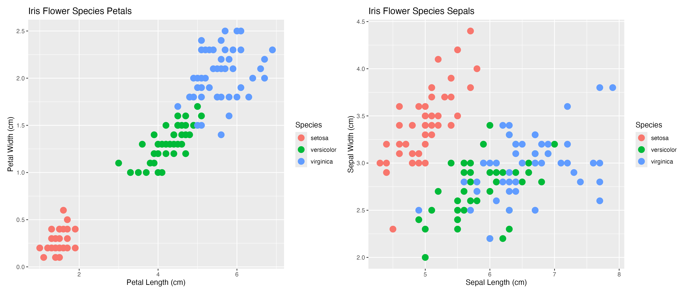

```{r setup, include=FALSE, message=FALSE, warning=FALSE}
knitr::opts_chunk$set(echo = TRUE)
```

# Question 3.1

### Prompt

Using the same data set (`credit_card_data.txt` or `credit_card_data-headers.txt`) as in Question 2.2, use the `ksvm` or `kknn` function to find a good classifier:

(a)	using cross-validation (do this for the k-nearest-neighbors model; SVM is optional); and
(b)	splitting the data into training, validation, and test data sets (pick either KNN or SVM; the other is optional).

## 3.1 Part A: Cross-Validation

The first step is to import the necessary libraries.
Second, the current working directory is defined so when credit card data can be imported.
Basically this defines that within the folder, `HW2-Validation-Clustering`, we know that the data is stored in `data/credit_card_data.txt`.
Next we will import the data into a table and then use `head()` to only show the first five rows to verify we imported the expected data set.
This should show columns of predictor variables data labeled `V1` to `V10` and the response target column, `V11`.

```{r, message=FALSE}
# Import libraries
library(kernlab) # SVM
library(kknn) # KNN

# Set the working directory
setwd("~/projects/ISYE6501/HW2-Validation-Clustering")

# Load the credit card data into a table similar to HW1
data <- read.table("data/credit_card_data.txt", stringsAsFactors = FALSE, header = FALSE)

# View the imported data to check import but only first few rows
head(data, 5)
```

After the data has been imported and confirmed, the response target needs to converted to a factor.
Using `as.factor()` allows for defining ``V11` as a categorical factor.
This is important because K-Nearest-Neighbors for classification requires the target (`V11`) to be categorical so that the model will identify this as a classification problem and not regression.
In addition, a seed is set since it is important for reproducibility. 

To consider cross-validation, k-fold cross validation was used with k-values from 1 to 50.

```{r, message=FALSE}
# Target variable V11 must be categorical
# Converting V11 to a factor defines it as a categorical variable
data$V11 <- as.factor(data$V11)

# Setting the seed is important for reproducibility
set.seed(123)

# Perform cross-validation to find the best k
k_values <- 1:50 # Define a range of k values to test

# Initialize a dataframe to store k values and corresponding accuracies
results_df <- data.frame(k = integer(), accuracy = numeric(), stringsAsFactors = FALSE)

# Initialize a vector to store the mean accuracy for each k
cv_accuracies <- numeric(length(k_values))

for (i in seq_along(k_values)) {
  k <- k_values[i]
  
  # Perform cross-validation
  cv_result <- cv.kknn(V11 ~ ., data = data, kcv = 10, k = k)
  
  # Extract accuracy values
  accuracy_values <- cv_result[[2]]
  
  # Calculate the mean accuracy for this k
  mean_accuracy <- mean(accuracy_values, na.rm = TRUE)
  cv_accuracies[i] <- mean_accuracy
  
  # Append results to the dataframe
  results_df <- rbind(results_df, data.frame(k = k, accuracy = mean_accuracy, stringsAsFactors = FALSE))
}

# Find the best k
best_k <- k_values[which.max(cv_accuracies)]
best_k_accuracy <- max(cv_accuracies, na.rm = TRUE)

# Print the best k and corresponding accuracy
cat("Best k:", best_k, "\n")
cat("Best k Accuracy:", best_k_accuracy, "\n")
```

From the results, the best k value is 14, and accuracy is 0.9388379.

## 3.1 Part B: Splitting Data

For the second part of 3.1, the data will be split into 3 parts including training, validation and testing.
Considering training data and testing data, the rule of thumb is 70-90% training and 10-30% testing.

Considering training data and testing data, the rule of thumb is 70-90% training and 10-30% testing.
Instead of using the whole data set, we will analyze the best k value and accuracy with a 70/30 split.


```{r, message=FALSE}
# Target variable V11 must be categorical
# Converting V11 to a factor defines it as a categorical variable
data$V11 <- as.factor(data$V11)

# Setting the seed is important for reproducibility
set.seed(123)

# Manually split the data into training (70%) and testing (30%) sets
sample_index <- sample(seq_len(nrow(data)), size = 0.7 * nrow(data))
trainData <- data[sample_index, ]
testData <- data[-sample_index, ]

# Perform cross-validation to find the best k
k_values <- 1:50 # Define a range of k values to test

# Initialize a dataframe to store k values and corresponding accuracies
results_df <- data.frame(k = integer(), accuracy = numeric(), stringsAsFactors = FALSE)

# Initialize a vector to store the mean accuracy for each k
cv_accuracies <- numeric(length(k_values))

for (i in seq_along(k_values)) {
  k <- k_values[i]
  
  # Perform cross-validation
  cv_result <- cv.kknn(V11 ~ ., data = trainData, kcv = 10, k = k)
  
  # Extract accuracy values
  accuracy_values <- cv_result[[2]]
  
  # Calculate the mean accuracy for this k
  mean_accuracy <- mean(accuracy_values, na.rm = TRUE)
  cv_accuracies[i] <- mean_accuracy
  
  # Append results to the dataframe
  results_df <- rbind(results_df, data.frame(k = k, accuracy = mean_accuracy, stringsAsFactors = FALSE))
}

# Find the best k
best_k <- k_values[which.max(cv_accuracies)]
best_k_accuracy <- max(cv_accuracies, na.rm = TRUE)

# Print the best k and corresponding accuracy
cat("Best k:", best_k, "\n")
cat("Best k Accuracy:", best_k_accuracy, "\n")
```

Splitting the data results in a different k and accuracy.
From the results, the best k value is 13, and accuracy is 0.9431072.
Note the plot is showing the k-value and the accuracy associated with it.

```{r, message=FALSE}
library(ggplot2)
# Plot k vs. accuracy
# Create the scatter plot with larger points and a label for k = 13 with accuracy value
plot <- ggplot(results_df, aes(x = k, y = accuracy)) +
  geom_point(size = 3, color = "blue") +               # Adjust the size and color of the points
  geom_text(data = subset(results_df, k == 13),         # Filter the dataframe for k = 13
            aes(label = paste0("k = ", k, " (", round(accuracy, 6), ")")), # Label text with accuracy value
            vjust = 2,                                # Vertical adjustment for label position
            hjust = 1,                                 # Horizontal adjustment for label position
            color = "red",                             # Color of the label text
            size = 4) +                                  # Size of the label text
labs(title = "K vs Accuracy",
     x = "Number of Neighbors (k)",
     y = "Accuracy") +
  theme_minimal() +                                    # Use a minimal theme for the plot
  theme(axis.text = element_text(size = 12),           # Increase axis text size for readability
        axis.title = element_text(size = 14))          # Increase axis title size for readability

# Show the plot
print(plot)
```


If you plug the best `k` value of 13 (accuracy = 0.943) into a final model the accuracy is 0.8426396.

```{r, message=FALSE}
# Train the final model with the best k
final_model <- kknn(V11 ~ ., trainData, testData, k = best_k)

# Predict and evaluate the model on the test set
test_predictions <- fitted(final_model)
confusion_matrix <- table(testData$V11, test_predictions)
accuracy <- sum(diag(confusion_matrix)) / sum(confusion_matrix)

# Print the accuracy on the test set
cat("Test Set Accuracy:", accuracy, "\n")
```
Best k: 13 
Best k Accuracy: 0.9431072 
Test Set Accuracy: 0.8426396 

\newpage
# Question 4.1

### Prompt

Describe a situation or problem from your job, everyday life, current events, etc., for which a clustering model would be appropriate. 
List some (up to 5) predictors that you might use.

## Clustering Models

Considering professional American football (National Football League or NFL), using clustering models can be effective to group players or teams based on similar characteristics or performance metrics. 
Using the Expectation Maximization (EM) algorithm, there have even been studies that use play-by-play data to observe the player trajectories and identify the routes run by eligible receivers on offensive passing plays [@chu2020route].

**Player Position Clustering:**

Using clustering to group players within a position (e.g., Quarterback, QB) could consider players style of play and performance metrics.
Clustering by player position would help teams identify the ideal players when scouting or for strategic purposes that may be ideal to their desires when building a team.

**Scheme Clustering:**

Clustering by scheme (offense/defense) could also be beneficial considering the offensive or defensive tendencies. 
This would help identify trends on play style across the league and also give teams an idea of other teams to study that are similar to their opponent.

**Performance-Based Team Clustering:**

Using clustering to identify which teams are similar based on performance metrics could also be considered. 
This would allow an understanding of where teams exceed in performance and similarities to help create strategies against your opponent.
Some predictors that would be considered for performance in clustering models include:

- **Yards per Attempt (YPA):** Yards per attempt is a metric that is valuable to evaluate a quarterback's passing efficiency. YPA looks at the distance the ball is thrown each pass play whether it is completed or not.
- **Broken or Missed Tackles:** To determine if a running back (RB) is particularly successful, this metric indicates the elusiveness from avoiding being taken down.
- **Pass Rush Win Rate:** This statistic is important for defensive players, showing how often they beat their blocker within 2.5 seconds.
- **Expected Points Added (EPA) per Play:** EPA is an advanced metric that measures the value of each play that adds to an offense's chance of scoring.
- **Personnel Usage Rates:** Usage rates will show the frequency teams use different formations. This would include for an offense things like 11 and 12 personnel to indicate how often they use certain schemes, providing insight into the opposing teams common strategy.


\newpage
# Question 4.2

### Prompt

The *iris* data set `iris.txt` contains 150 data points, each with four predictor variables and one categorical response. 
The predictors are the width and length of the sepal and petal of flowers and the response is the type of flower. 
The data is available from the R library datasets and can be accessed with iris once the library is loaded. 
It is also available at the UCI Machine Learning Repository (https://archive.ics.uci.edu/ml/datasets/Iris). 
*The response values are only given to see how well a specific method performed and should not be used to build the model.*

Use the R function `kmeans` to cluster the points as well as possible. 
Report the best combination of predictors, your suggested value of k, and how well your best clustering predicts flower type.
  
## K-Means Clustering
  
The first task to approach this problem is to observe the *iris* data set provided in `iris.txt`.
The appropriate packages are loaded and the current working directory is defined so that we can run the code and import the data set.
Defining the current working directory is important because `iris.txt` is located in a subfolder for ISYE 6501 that contains homework 2.
The data is imported into a table and considers there are headers to label each column.
Using `head(data, 5)` we can observe a small snippet of the iris data (first 5 rows) to identify what we are working with.
As the prompt states, there are 4 predictors that include length and width, with the species of the flower as the categorical response.
These are noted in our data column names `Sepal.Length`, `Sepal.Width`, `Petal.Length`, `Petal.Width`, and `Species`.
  
```{r, message=FALSE}
# Import library to plot
library(ggplot2)
library(patchwork)

# Set the working directory
setwd("~/projects/ISYE6501/HW2-Validation-Clustering")

# Load the iris data set
data <- read.table("data/iris.txt", stringsAsFactors = FALSE, header = TRUE)

# Show the first 10 rows of data
head(data, 5)
```

Note that I did not define `library()` to import a `kmeans` package, this is because `kmeans` is provided in R's base package so I do not need to import.
If you want to check if it is installed prior to running the code, use `exists("kmeans")` in the console and it should return `[1] TRUE`.

Before working with the data and `kmeans` to cluster the points, a scatter plot is generated to observe the current data.
The code is below the figure to describe how the 2 subplots were generated side by side and other considerations.
Observing the figure below, it is clear that when considering the length and width of the petals, the `setosa` species of the Iris flower appears to be easy to cluster.
Considering both petals and sepals, `versicolor` and `verginica` are not as obvious on optimal clustering due to the proximity of each data point.


```{r, fig.show='hold', fig.cap="Iris flower species petals and sepals", out.width="100%", fig.align='center', echo=FALSE}

```

The scatter plots were generated using `ggplot2` [@ggplot2] to observe the data set. The library `patchwork` is utilized to arrange the plots side by side.
The point of the scatter plot is to observe the flower species and visualize the data that needs to be clustered.
Units are described in the repository [@irisdatabase] to create proper axis labels.

```{r, message=FALSE}
# Plot the petal data to look at the data set before clustering
petal_plot <- ggplot(data, aes(Petal.Length, Petal.Width)) +
  geom_point(aes(col = Species), size = 4) +
  labs(
    title = "Iris Flower Species Petals",
    x = "Petal Length (cm)",
    y = "Petal Width (cm)"
  )
# Save the plot
ggsave("figures/petal_species.png", petal_plot, width = 10, height = 6, dpi = 300)

# Plot the sepal data to look at the data set before clustering
sepal_plot <- ggplot(data, aes(Sepal.Length, Sepal.Width)) +
  geom_point(aes(col = Species), size = 4) +
  labs(
    title = "Iris Flower Species Sepals",
    x = "Sepal Length (cm)",
    y = "Sepal Width (cm)"
  )
# Save the plot
ggsave("figures/sepal_species.png", sepal_plot, width = 10, height = 6, dpi = 300)

# Combine and display the plots side by side using patchwork
combined_plot <- petal_plot + sepal_plot
# Save the plot with both side by side
ggsave("figures/combined_plots.png", plot = combined_plot, width = 14, height = 6, dpi = 300)
```

After viewing the data, it is notable that clustering is performed by grouping *unlabeled* data and this data set is labeled.
We can work around this by considering the 4 predictors and neglecting the column `Species`.

The next step is to utilize the data set with `kmeans` to cluster the points as well as possible. 

```{r, message=FALSE}
best_model <-kmeans(data[,1:4],3,nstart=5,iter.max=50) 
table(data[,5], best_model$cluster)
```

```{r, message=FALSE}
#Visualisation of resuls using fviz_cluster from factoextra
library("factoextra")

data_filter <- scale(data[,1:4]) 
fviz_cluster(best_model, data = data_filter, geom = "point", 
             stand = FALSE, ellipse.type = "norm")
```

```{r, message=FALSE}
fviz_nbclust(data_filter, kmeans, method = "wss") + geom_vline(xintercept = 3, linetype = 2) 
```
  


\newpage
# References


