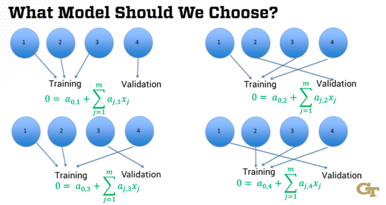

# Module 3 - Validation

## Overview

Module 3 will continue with basic machine learning algorithms.
The modules will cover couple of cross-cutting concepts and the important topic of model validation.

Additional References: 

[@arlot2010survey]. [A Survey of Cross-Validation Procedures for Model Selection](https://www.di.ens.fr/willow/pdfs/2010_Arlot_Celisse_SS.pdf)

## M3L1 - Introduction to Validation 

Validation

- How good is the model?

Data has two types of patterns

- **Real Effect** - Real relationship between attributes and response
- **Random Effect** - Random, but looks like a real effect

Fitting matches both real and random effects

- Real effects - Same in all data sets
- Random effects - Different in all data sets

**Example: What day of the month were you born?**

- Training Data: 3, 21, 24, 24, 25, 26, 27, 30, 30, 31
- Best Predictor: You were born on the 26th 
  - Right in the middle of 9/10 data points
- **This is a random effect!**
- This model using 9/10 from 21-31 doesn't have a large error
- If new data showed 2, 9, 11, 12, 14, 21, 24, 24, 29, 31
  - Much larger error due to the uniform spread over the month
- Was this just luck? (3, 21, 24, etc.)
  - No, some random pattern would have shown up
    - Early in month
    - Middle of month
    - Even/odd numbered day
    - Day is multiple of 3
    - Day is close to one of my kids birthdays
    - Etc.

### M3L1 - Summary

- The example proves we can't measure the model's effectiveness on data it was trained on
- Model fit captures real and random effects
- Only real effects are duplicated in other data

*Don't judge a model based on how well it fits the training data*.

- Validation is crucial to determine how good a model is and how accurately it performs on new data
- Measuring a model's performance on the same training data used to create it is not a good approach, as it will be too optimistic
- Any dataset contains both real effects (true relationships) and random effects (patterns that occur by chance)
- When fitting a model to training data, it captures both real and random effects
- However, when using the model on new data, only the real effects will persist, while the random effects will be different
- An example is given of a silly model that predicts people's birth dates based on a random pattern in the training data, which would not generalize well
- The key takeaway is that we cannot rely on training data performance to evaluate a model - we need a separate validation process to get an accurate assessment of its effectiveness

## M3L2 - Validation and Test Data Sets

**Measure a model's performance:**

- A larger set of data to fit the model
- A smaller set of data to measure the model's effectiveness

Splitting Data:

- Training set (larger) to fit model
- Validation set (smaller) to estimate effectiveness

Training and Validation Sets:

- Observed performance = real quality + random effects
  - High-performing models more likely to have *above-average random effects*
- Observed performance of chosen model is *probably too optimistic*

Test Sets:

- Training data set to fit the models
- Validation data set to choose best model
- Test data set to estimate performance of chosen model 

Overall: 

- Training Set - Building models
- Validation Set - Picking a model
- Test Set - Estimating performance of chosen model

### Summary

- Using only training data to evaluate a model's performance is often too optimistic, as the model overfits to random patterns in the training data.
- **To get a better measure of performance, we use separate validation and test sets:**
  - Training set: Used to fit/build the model
  - Validation set: Used to evaluate and compare different models
  - Test set: Used to get an unbiased final estimate of the chosen model's performance
- The validation set helps select the best model, but its performance estimate may still be inflated due to random chance when choosing the "best" model.
- The test set provides a final unbiased performance estimate for the selected model.
- **General process:**
  - Train multiple models on training data
  - Evaluate models on validation set and select best one
  - Estimate final performance of chosen model on test set
- This three-way split helps avoid overfitting and provides a more realistic assessment of how well the model will generalize to new data.
- There are different ways to split data into training, validation and test sets, which will be covered in a future lesson.

**The key takeaway is that using separate datasets for training, model selection, and final evaluation helps produce more reliable and generalizable machine learning models.**

## M3L3 - Splitting Data

- Training data too optimistic so we need to use a test set
- Training data set to build model
- Validation set to compare models
- Test set to estimate performance of chosen model

**How do we split data into traning, validation, and test sets?**

- Method 1: Random - Randomly choose data points
- Method 2: Rotation - Take turns selecting points

**Training-Validation-Training-Test-Training**

- Randomness could give one set more early or late data
  - Rotation equally separates data
- Rotation may introduce bias

### Summary

- Data needs to be split into training, validation, and test sets to properly evaluate model performance.
- **Recommended splits:**
  - For two sets: 70-90% training, 10-30% testing (Rule of thumb)
  - For three sets:
    - 50% training, 25% validation, 25% testing
    - 60% training, 20% validation, 20% testing
    - 70% training, 15% validation, 15% testing
- **Two main approaches for splitting data:**
  - Simple randomness: Randomly assign data points to each set
  - Rotation: Systematically rotate through assigning points to each set
- **Advantages of rotation:**
  - Ensures equal representation of data across time periods
  - Avoids potential biases from random sampling
- **Disadvantages of rotation:**
  - May introduce other biases if not done carefully (e.g. only certain days of week in each set)
- A hybrid approach combining randomness and rotation can be used to avoid biases.
- Cross-validation is another technique for using data, which will be covered in a future lesson.

**It is important to properly split data to get accurate model evaluations, while there are tradeoffs between different splitting approaches.**

## M3L4 - Cross-Validations

- What if important data only appears in validation or test sets? *Use cross-validation!*

- Use of `k` in analytics
  - k-means
  - k-nearest neighbor
  - k-fold cross validation

**k-fold Cross-Validation**

- For each of the `k` parts:
  - Train the model on all the other parts
  - Evaluate it on the one remaining part
- *Average the k evaluations to estimate the model's quality*
- No standard number for `k`, but `k=10` is common

```{r, fig.show='hold', fig.cap="k-Fold Cross Validation", out.width="100%", fig.align='center', echo=FALSE}

```

**ANSWER: NONE!**

- Do not average the coefficients over four splits
- Train the model again using all the data

k-Fold Cross-Validation provides:

- Better use of data
- Better estimate of model quality
- Choose model more effectively


### Summary

- **Purpose of Cross-Validation:** Cross-validation is introduced as a technique to ensure that important data points are not excluded from the training set, which can happen if they only appear in the validation or test sets. This method helps in making better use of the data available.
- **Types of Cross-Validation:** The lecture specifically discusses k-fold cross-validation, a popular method in analytics. The 'k' in k-fold cross-validation indicates the number of parts the data is split into for training and validation purposes.
- **Process of K-Fold Cross-Validation:**
  - The data is divided into k parts. For example, if k=4, the data is split into four parts.
  - The model is trained on k-1 parts and validated on the remaining part. This process is repeated k times, with each part being used as the validation set once.
  - Every data point is used for training in k-1 models, ensuring no important data is left out.
- **Model Evaluation:** The performance of the model is evaluated by averaging the results from the k different validation sets. This average provides an estimate of the model's quality.
- **Choosing the Final Model:** After using cross-validation to select a model, the final model is retrained using all the data parts together. This ensures the model benefits from the full dataset.
- **Common Practice:** While there is no standard number for k, using k=10 is common in practice.

**Overall, cross-validation is emphasized as a crucial step in model selection and evaluation, helping to improve the reliability of the analytics process.**


