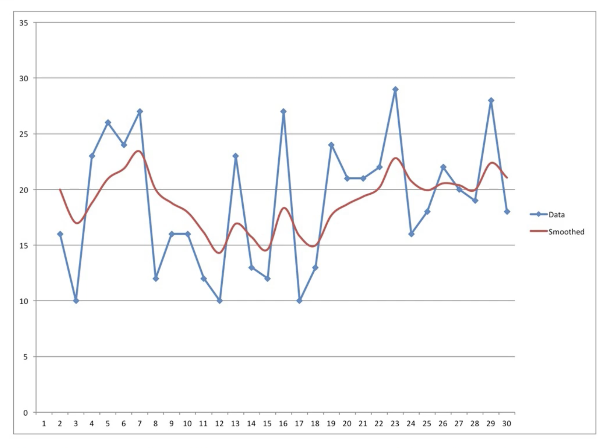
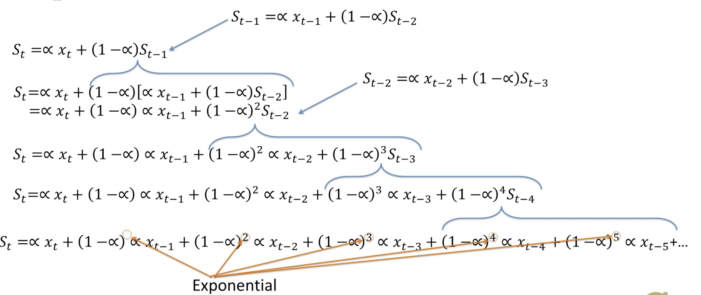

# Module 7 - Time Series Models

## M7L1 - Introduction to Exponential Smoothing

*Lecture 1 - Introduction to Exponential Smoothing (3:58)*

### Time Series Data

Time series data - Data where the same response is known for many time periods.

- Trends over time (e.g., stock price)
- Cyclical variations (e.g., temperature)
- Random variation (e.g., Temperatures, stock prices, blood pressure)

### Exponential Smoothing Method

**Example:**

- $S_t$: Expected response or baseline (e.g., Blood pressure at hour t)
- $x_t$: The observed response (e.g., Observed blood pressure at t)

*Two ways to answer:*

- $S_t=x_t$: Observed blood pressure is a real indicator of the baseline
- $S_t = S_{t-1}$: Today's baseline is the same as yesterdays baseline

**Solution - Exponential Smoothing Method:**

$$
S_t = \alpha x_t + (1 - \alpha) S_{t-1}
$$
In the equation above, $S_t$ is the expected baseline response at time period $t$. 
The observed response is defined as $x_t$ and the range for $\alpha$ is defined as $0 < \alpha < 1$. 
Tuning $\alpha$ to 0 means there is a lot of randomness in the system, while a value of 1 means there is *not* a lot of randomness in the system.

**How to Start:**

- Initial condition: $S_1 = x_1$
- Does not deal with trends or cyclical varations

## M7L2 - Trend and Cyclic Effects

*Lecture 2 - Trend and Cyclic Effects (6:06)*

### Exponential Smoothing Method

$$
S_t = \alpha x_t + (1 - \alpha) S_{t-1}
$$

- $0 < \alpha < 1$
  - Helps trade off between trusting $x_t$ when $\alpha$ is large
  - Trusting $S_{t-1}$ when $\alpha$ is small
  - More randomness: Trust previous estimates $S_{t-1}$, Small $\alpha$
  - Less randomness: Trust what you see, may indicate real change, larger $\alpha$
  
### Trends
  
- $T_t$: the trend at time period t
- $S_t = \alpha x_t + (1 - \alpha) (S_{t-1} + T_{t-1})$
  - Now includes the previous trend, $T_{t-1}$
- $T_{t} = \beta (S_t - S_{t-1}) + (1-\beta)T_{t-1}$
  - $\beta$ times observed trend plus $\beta$ times previous trend
  - Initial condition: $T_1=0$
  
### Cylic Patterns
  
- Like trend - additive component of formula
- Alternative
  - **Seasonalities:** Multiplicative way
    - $L$: Length of cycle
    - $C_t$: Multiplicative seasonality factor for time t
      - Inflate or deflate the observation
  - *New baseline formula (including trend and seasonality)

$$
S_t = \frac{\alpha x_t}{C_{t-L}} + (1-\alpha)(S_{t-1}+T_{t-1})
$$
- Update the seasonal, or cyclic, factor in similar way
  - $C_t = \gamma(x_t/S_t) + (1-\gamma)C_{t-L}$
  - $C_1, \dots, C_L=1$
  - No initial cyclic effect
  - $x_t$: Observation
  - $S_t$: Baseline
  - $C_{t-L}$: Previous cylic factor

- Example: Selling burgers
  - If C = 1.1 on Sunday, sales were 10% higher just because it was Sunday
  - Of 550 sold on Sunday
    - 500 = baseline value
    - 50 = 10% extra

**Starting Conditions:**

- Trend: $T_1=0$
  - Shows no initial trend
- Multiplicative Seasonality: Multiplying by 1
  - Shows no initial cyclic effect
  - First L values of C set to 1

### Models

- Exponential smooth model
  - Sometimes called single, double, triple
  - Depends on how many seasonal aspects you include

- Triple exponential smooth is also called **Winter's method** or **Holt-Winters method**

## M7L3 - Exponential Smoothing - What the Name Means

*Lecture 3 - Exponential Smoothing - What the Name Means (3:35)*

- Previously: Discussed exponential smoothing
  - Analyzing time series data where the same response is known for many time periods

### Basic single exponential smoothing

$$
S_t = \alpha x_t + (1 - \alpha) S_{t-1}
$$
**Example:**

- $\alpha=0.5$
- $S_t = 0.5 x_t + 0.5 S_{t-1}$
- High observed value $x_t$: $S_t$ not as high; pulled down by $(1-\alpha)S_{t-1}$
- Low observed value $x_t$: $S_t$ not as low; pulled up by $(1-\alpha)S_{t-1}$

*This is where the name exponential smoothing comes from!*

- Peaks and valleys are smoothed out

```{r, fig.show='hold', fig.cap="Exponential smoothing example", out.width="100%", fig.align='center', echo=FALSE}

```

- $S_t = \alpha x_t + (1 - \alpha) S_{t-1}$
  - $S_{t-1} = \alpha x_{t-1} + (1-\alpha)S_{t-2}$
- Plug in $S_{t-1}$ and we now have:
  - $S_t = \alpha x_t + (1 - \alpha) [\alpha x_{t-1} + (1-\alpha)S_{t-2}]$
  - $= \alpha x_t + (1 - \alpha) \alpha x_{t-1} + (1-\alpha)^2 S_{t-2}$
- Where now $S_{t-2}=\alpha x_t-2 + (1-\alpha)S_{t-3}$

Continuing we have an equation for $S_t$ with observations from the past each weighted by $1-\alpha$ to an increasing exponent.

```{r, fig.show='hold', fig.cap="Exponential equation expanded", out.width="100%", fig.align='center', echo=FALSE}

```

- Every past observation contributes to the current baseline estimate
- More recent observations are more important
  - Newer observations weighted more

## M7L4 - Forcasting

*Lecture 4 - Forcasting (3:39)*

- Exponential smoothing can be used for *simple forecasting*
  - Predict what will happen next

### Forecasting

- Remember the basic exponential smooth equation
  - $S_t = \alpha x_t + (1 - \alpha) S_{t-1}$
- Prediction
  - $S_{t+1} = \alpha x_{t+1} + (1 - \alpha) S_{t}$
  - $x_{t+1}$ is **unknown**
  - Best guess: $x_{t+1}=S_t$
- Our forecast for time period t+1
  - $F_{t+1} = \alpha S_t + (1-\alpha) S_t$
  - Our guess for next time period is same as current baseline
  - $F_{t+1} = S_t$

### Forecasting with Trend

- Include the trend
  - $S_t = \alpha x_t + (1 - \alpha) (S_{t-1}+T_{t-1})$
  - $T_{t} = \beta (S_t - S_{t-1}) + (1-\beta)T_{t-1}$
- The best estimate of the next baseline
  - Most current baseline estimate
- The best estimate of the trend with the most current trend estimate
- Our forecast for time period t+1
  - $F_{t+1}=S_t + T_t$
- $F_{t+k}=S_t + k T_t, k=1,2,\dots$

### Forecasting with Multiplicative Seasonality

- Include multiplicative seasonality
  - $S_t = \frac{\alpha x_t}{C_{t-L}} + (1-\alpha)(S_{t-1}+T_{t-1})$
- The best estimate of the next time period's seasonal factor
  - $C_{t+1}=C_{(t+1)-L}
- Forecast for the time period t+1
  - $F_{t+1}=(S_t + T_t)C_{(t+1)-L}$
- $F_{t+k}=(S_t + kT_t)C_{(t+1)-L+(k-1)}, k=1,2,\dots$

### Future

- How to find good values for $\alpha$, $\beta$, and $\gamma$
  - Optimization: $\min(F_t-x_t)^2$
- Other methods for analyzing time series data

## M7L5 - ARIMA

*Lecture 5 - ARIMA (6:36)*

### ARIMA

**Auto Regressive Integrated Moving Average (ARIMA)**
- General method for measuring time-series data
- No underlying theory discussed, in *Time Series Analysis* course

**ARIMA - 3 Key Parts**

### Part I - Differences

- Exponential Smoothing: $S_t = \alpha x_t + (1 - \alpha) S_{t-1}$
- $S_t = \alpha x_t + (1 - \alpha) \alpha x_{t-1} + (1 - \alpha)^2 \alpha x_{t-2} + (1 - \alpha)^3 \alpha x_{t-3}+\dots$
  - Estimate $S_t$ based on $x_t$, $x_{t-1}$, etc.
  - Works well if data is stationary
  
- **Stationary Process**: If the mean, variance and other measures all expected to be constant over time
- Often data is not stationary, but the difference might be stationary
- For example:
  - First order difference $D_{(1)}$: Difference of consecutive observations
    - $D_{(1)t}=(x_t - x_{t-1)}$
  - Second order difference $D_{(2)}$: Differences of the differences
    - $D_{(2)t}=(x_t - x_{t-1)}-(x_{t-1}-x_{t-2})$
  - Third order difference $D_{(3)}$: Differences of the differences of the differences
    - $D_{(3)t}=[(x_t - x_{t-1)}-(x_{t-1}-x_{t-2})]-[(x_{t-1}-x_{t-2})-(x_{t-2}-x_{t-3})]$
    
### Part II - Autoregression

- Predicting the current value based on previous time periods' values
- Regression: Predicting the value based on other factors
- Auto: Using earlier values to predict, only works with time series data

- Exponential smoothing: order-$\infty$ autogregressive model
  - $S_t = \alpha x_t + (1 - \alpha) \alpha x_{t-1} + (1 - \alpha)^2 \alpha x_{t-2} + (1 - \alpha)^3 \alpha x_{t-3}+\dots$
  - Uses data all the way back
- Order-p autoregressive model: $S_t$ is a function of ${x_t, x_{t-1}, x_{t-2}, \dots, x_{t-(p-1)}}$
  - Go back only p time periods
- ARIMA combines *autoregression* and *differencing*
  - Autoregression on the differences
  - Use p time periods of previous observations to predict d-th order differences
  
### Part III - Moving Average

- Previous errors $\epsilon_t$ as predictors
  - $\epsilon_t = (\hat{x}_t-x_t)$
- Order-q moving average
  - Go back q time periods
  - $\epsilon_t, \epsilon_{t-1}, \epsilon_{t-2}, \dots, \epsilon_{t-q}$

ARIMA(p,d,q) Model

$$
D_{(d)t}=\mu + \sum_{i=1}^p a_i D_{(d)t-i} -\sum_{i=1}^q \theta_i(\hat{x}_{t-i}-x_{t-i})
$$

- dth-order differences
- pth-order autoregression
- qth-order moving average

- General model
  - Add seasonality
- Specific values of p, d, and q
  - `ARIMA(0,0,0)`: White noise
  - `ARIMA(0,1,0)`: Random walk
  - `ARIMA(p,0,0)`: AR (Autoregressive) model
  - `ARIMA(0,0,q)`: MA (Moving Average) model
  - `ARIMA(0,1,1)`: Basic exponential smoothing model
  
- Short-term forecasting
  - Better than exponential smoothing
    - When the data is more stable, with fewer peaks, valleys, and outliers
- Need 40 past data points for ARIMA to work well

**Summary**: ARIMA models help estimate or forecast a value
  


## M7L6 - GARCH

*Lecture 6 - GARCH (2:56)*

**Generalized Autoregressive Conditional Heteroscedasticity (GARCH)**
- Estimate or forecast the variance

### Variance

- Estimate the amount of error
- Example:
  - Forecast demand for pickup trucks
  - Variance - How much forecast might be higher or lower than true value

### Variance Estimation

- Important in investment
  - Traditional portfolio optimization model
    - Balances the expected return of a set of investments with amount of volatility

- Types of portfolios
  - Riskier: Higher expected return
  - Less-risky: Lower expected return
- Variance: A Proxy for the amount of volatility or risk
- **GARCH**: A common approach for estimating variance

**ARIMA Model**:

$$
D_{(d)t}=\mu + \sum_{i=1}^p a_i D_{(d)t-i} -\sum_{i=1}^q \theta_i(\hat{x}_{t-i}-x_{t-i})
$$

**GARCH Model**:

$$
\sigma_t^2 = \omega + \sum_{i=1}^p \beta_i \sigma_{t-i}^2 + \sum_{i=1}^q \gamma_i \epsilon^2_{t-i}
$$

**Two differences from ARIMA**:

- Variances/squared errors
  - Not observations/linear errors
- Raw variances
  - Not differences of variances

### Summary

Three methods - Analyzing time series

- Exponential smoothing
- ARIMA
- GARCH