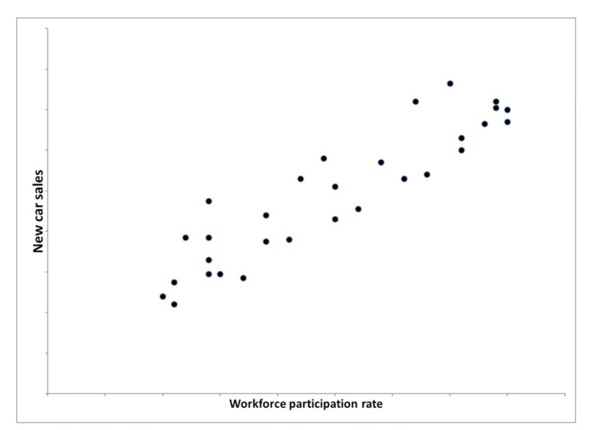
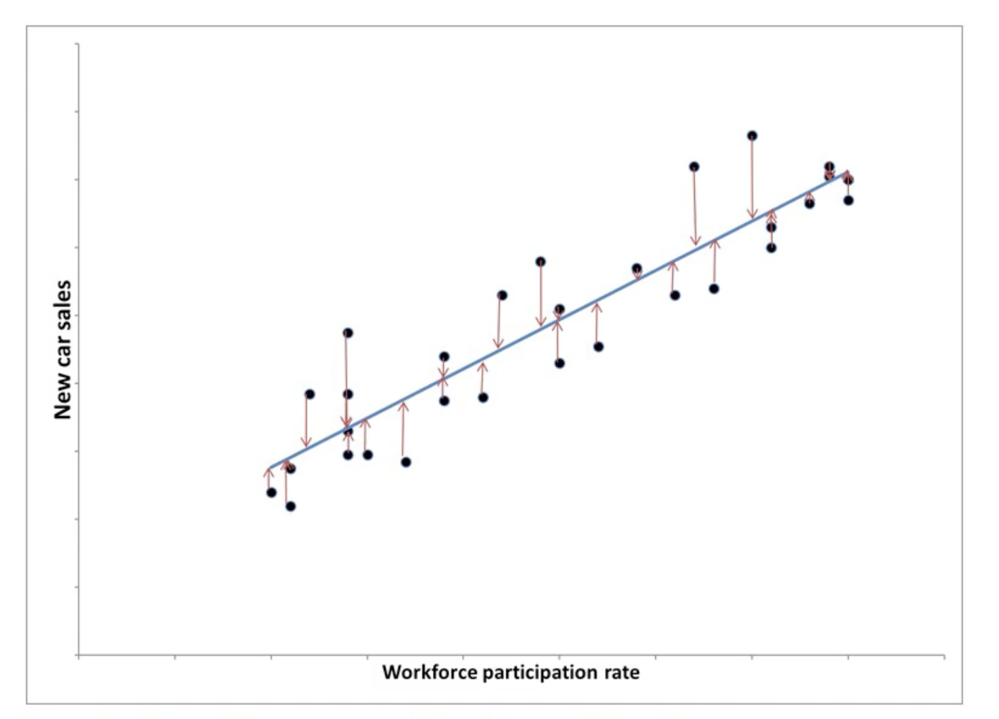

# Module 8 - Basics of Regression

Module 8 will cover the basics of regression, along with the concepts of estimating a model’s quality and distinguishing between correlation and causation.  

## M8L1 - Introduction to Regression

*Lecture 1 - Introduction to Regression (5:12)*

### Regression

Regression is one of the most common models in analytics.
Regression can answer two types of questions.

- How do systems work? Examples:
  - Value of a home run
  - Effect of economic factors on presidential election
  - Impact of education on income
  - Key factors in car purchasing
  
- What will happen in the future? Examples:
  - Height of a child at adulthood
  - Oil price 1.5 years from now
  - Housing demand in next 6 months
  - Remaining lifetime of insurance applicant

### Simple Linear Regression (SLR)

- Linear regression with one predictor
- Look for linear relationship between predictor and response

Example: Effect of unemployment on new car sales

- $y$: Response (new car sales)
- $x_1$: Predictor (workforce participation)

**Regression Equation:**
\begin{equation}
  y = a_0 + a_1x_1
  (\#eq:regression)
\end{equation}

**Regression Equation with $m$ Predictors:**
\begin{equation}
  \begin{split}
      y &= a_0 + a_1x_1 + a_2x_2 + \dots +  + a_mx_m \\
      &= a_0 + \sum_{j=1}^m a_jx_j
  \end{split}
  (\#eq:regression-m)
\end{equation}

```{r, fig.show='hold', fig.cap="Linear regression with one predictor", out.width="100%", fig.align='center', echo=FALSE}

```

Measure the quality of the line's fit with squared errors.

- $y_i$: Cars sold for data point $i$
- $\hat{y}_i$: Model's prediction of cars sold

**Data point $i$ Prediction Error:**
\begin{equation}
  y_i - \hat{y}_i = y_i - (a_0 + a_1x_{i1})
  (\#eq:pred-error)
\end{equation}

**Sum of Squared Errors:**
\begin{equation}
  \begin{split}
    & \sum_{i=1}^n (y_i - \hat{y}_i)^2 \\
    &= \sum_{i=1}^n (y_i - \big(a_0 + a_1x_{i1})\big)^2
  \end{split}
  (\#eq:sq-errors)
\end{equation}

```{r, fig.show='hold', fig.cap="Linear regression prediction error", out.width="100%", fig.align='center', echo=FALSE}

```

Why the sum of squared errors?

- See lesson on estimating model quality

Best-fit regression line

- Determine line fit by sum of squared errors
- Minimizes sum of squared errors
- Defined by $a_0$ and $a_1$

Underlying math

- Sum of squared errors - Minimize convex quadratic function
  - Set partial derivatives to zero
  - Solve simultaneous equations

### Summary

- Linear regression
  - Answers two questions
    - How do systems work?
    - What will happen in the future

**Key Equations:**

- Regression Equation: Eq. \@ref(eq:regression)
- Regression Equation with $m$ Predictors: Eq. \@ref(eq:regression-m)
- Data point $i$ Prediction Error: Eq. \@ref(eq:pred-error)
- Sum of Squared Errors: Eq. \@ref(eq:sq-errors)


## M8L2 - Maximum Likelihood and Information Criteria

*Lecture 2 - Maximum Likelihood and Information Criteria (7:56)*

I this lesson, we cover how to measure the quality of a model's fit.

### Likelihood

**Likelihood:**

- Basic measure of quality is **likelihood**
- Assume the data is the correct value and we have information about the variance
- Measure the probability (density) for any parameter set
- Maximum likelihood (highest probability density)
  - Parameters that give the highest probability

### Maximum Likelihood Example

Example:

- Error ~ $N(0, \sigma^2), i.i.d.
  - **i.i.d.** - Independent and identically distributed random variables
- Observations: $z_1,\dots,z_n$
- Model estimates: $y_1,\dots,y_n$

**Probability Density for Observing $z_i$ if true value is $y_i$:**
\begin{equation}
  \frac{1}{\sigma \sqrt{2\pi}}\exp^{\frac{(z_i-y_i)^2}{2\sigma^2}}
  (\#eq:prob-density)
\end{equation}

**Joint Density over all $n$ terms:**
\begin{equation}
  \begin{split}
    & \prod_{i=1}^n \frac{1}{\sigma \sqrt{2\pi}}\exp^{\frac{(z_i-y_i)^2}{2\sigma^2}} \\
    &= \bigg(\frac{1}{\sigma \sqrt{2\pi}}\bigg)^n\exp^{-\frac{1}{2\sigma^2}\sum_{i=1}^n(z_i-y_i)^2}
  \end{split}
  (\#eq:joint-density)
\end{equation}

Joint density is the product because the errors are all independent.
Since the exponential function gets larger as exponent gets larger we can find the largest value of the whole expression by the largest exponent.
We can remove the constants and we are left with a negative sum of the squared errors.
If errors are normally distributed and independent and identically distributed (i.i.d.) then the set of parameters that minimizes the sum of squared errors is the maximum likelihood fit.

- Error ~ $N(0, \sigma^2), i.i.d.
- Observations: $z_1,\dots,z_n$
- Model estimates: $y_1,\dots,y_n$
- MLE (Maximum Likelihood Example)
  - The set of parameters that minimizes the sum of squared errors (explained above)

**Maximum Likelihood Fit:**
\begin{equation}
  \max \bigg(\frac{1}{\sigma \sqrt{2\pi}}
  \bigg)^n\exp^{-\frac{1}{2\sigma^2}\sum_{i=1}^n(z_i-y_i)^2}
  \rightarrow \min \sum_{i=1}^n (z_i-y_i)^2
  (\#eq:max-likelihood)
\end{equation}

In the case of basic linear regression:

- $y_i = a_0 + \sum_{j=1}^m a_j x_{ij}$
- $\sum_{i=1}^n (z_i-y_i)^2$
- Minimize $\sum_{i=1}^n (z_i-y_i)^2$ over the parameters $a_0,\dots,a_m$

**Maximum Likelihood of Basic Linear Regression:**
\begin{equation}
  \min \sum_{i=1}^n \big(z_i - (a_0 + \sum_{j=1}^m a_j x_{ij}) \big)^2
  (\#eq:max-likelihood-linear-regression)
\end{equation}

Can use likelihood to compare to different models with the likelihood ratio, the ratio of likelihoods and conducting a hypothesis test.

### Maximum Likelihood Fitting

**Simple example:**

- Regression with independent normally distributed errors

**Can get complex fast:**

- Different estimation formulas
- Different assumptions about the error

**Good statistical software:**

- Can handle more complexity than simple regression

### Akaike Information Criterion (AIC)

**Akaike information criterion (AIC)** is an estimator of prediction error and thereby relative quality of statistical models for a given set of data.

- Provide collection of models for the data
- AIC estimates quality of each model, relative to other models
- Provides a means for model selection

**Akaike Information Criterion (AIC):**
\begin{equation}
  AIC = 2k - 2\ln(L^*)
  (\#eq:aic)
\end{equation}

- $L^*$: Maximum likelihood value
- $k$: Number of parameters being estimated
- $2k$ is a *penalty term*, balances likelihood with simplicity
  - Helps avoid overfitting

## AIC Example

**Regression with AIC:**
\begin{equation}
  \begin{split}
    AIC &= 2k - 2\ln(L^*) \\
    &= 2k-2\ln\bigg(\bigg(\frac{1}{\sigma \sqrt{2\pi}}
    \bigg)^n\exp^{-\frac{1}{2\sigma^2}\sum_{i=1}^n\big(z_i-
    (a_0 + \sum_{j=1}^m a_jx_{ij})\big)^2}\bigg) \\
    &= 2(m+1)-2\ln\bigg(\bigg(\frac{1}{\sigma \sqrt{2\pi}}
    \bigg)^n\exp^{-\frac{1}{2\sigma^2}\sum_{i=1}^n\big(z_i-
    (a_0 + \sum_{j=1}^m a_jx_{ij})\big)^2}\bigg)
  \end{split}
  (\#eq:aic-regression)
\end{equation}

- Prefer models with smaller AIC
- Making AIC encourages fewer parameters $k$ and higher likelihood
- Nice properties if there are infinitely many data points
  - We aren't going to have infinitely many data points and good luck storing it
- For smaller data sets we need a correction

### Corrected AIC ($AIC_C$)

Corrected AIC ($AIC_C$) is used for smaller data sets

\begin{equation}
  \begin{split}
    AIC_C &= AIC + \frac{2k(k+1)}{n-k-1} \\
    &= 2k - 2\ln(L^*) + \frac{2k(k+1)}{n-k-1}
  \end{split}
  (\#eq:aic-c)
\end{equation}

**$AIC_C$ Example:**

- Model 1: AIC = 75
- Model 2: AIC = 80

**Relative likelihood:**
\begin{equation}
  \begin{split}
    & \exp^{\frac{(AIC_1-AIC_2)}{2}} \\
    & \exp^{\frac{(75-80)}{2}} \approx 8.2\%
  \end{split}
  (\#eq:aic-c-rel-likelihood)
\end{equation}

- Model 2 is 8.2% as likely as Model 1 to be better
- This means the first model is probably better

### Bayesian Information Criterion (BIC)

When fitting models, it is possible to increase the maximum likelihood by adding parameters, but doing so may result in overfitting. 
Both BIC and AIC attempt to resolve this problem by introducing a penalty term for the number of parameters in the model; the penalty term is larger in BIC than in AIC for sample sizes greater than 7.

**Bayesian Information Criterion (BIC):**
\begin{equation}
  AIC = k\ln(n) - 2\ln(L^*)
  (\#eq:bic)
\end{equation}

- $L^*$: Maximum likelihood value
- $k$: Number of parameters being estimated
- $n$: Number of data points

BIC is similar to AIC.

- BIC's penalty term > AIC's penalty term
  - BIC encourages models with fewer parameters than AIC does
- *Only use BIC when there are more data points than parameters*

When comparing two models on the same data set by BIC their is a rule of thumb.

**BIC Rule of Thumb Comparing Models:**

- $|BIC_1-BIC_2 > 10$
  - Smaller-BIC model is *"very likely"* better
- $6 < |BIC_1-BIC_2 < 10$
  - Smaller-BIC model is *"likely"* better
- $2 < |BIC_1-BIC_2 < 6$
  - Smaller-BIC model is *"somewhat likely"* better
- $0 < |BIC_1-BIC_2 < 2$
  - Smaller-BIC model is *"slightly likely"* better

### Summary

- No hard-and-fast rule for using AIC or BIC or maximum likelihood
  - The AIC is a frequentist point-of-view and BIC is a bayesian point-of-view that get into the philosophy of statistics (beyond scope of course)
- All three can give valuable information
- Looking at all three can help you decide which is best

**Key Equations:**

- Probability Density for Observing $z_i$ if true value is $y_i$: Eq. \@ref(eq:prob-density)
- Joint Density over all $n$ terms: Eq. \@ref(eq:joint-density)
- Maximum Likelihood Fit: Eq. \@ref(eq:max-likelihood)
- Maximum Likelihood with Basic Linear Regression: Eq. \@ref(eq:max-likelihood-linear-regression)
- Akaike Information Criterion (AIC): Eq. \@ref(eq:aic)
- AIC with Regression: Eq. \@ref(eq:aic-regression)
- Corrected AIC ($AIC_C$): Eq. \@ref(eq:aic-c)
- $AIC_C$ Relative Likelihood: Eq. \@ref(eq:aic-c-rel-likelihood)
- Bayesian Information Criterion (BIC): Eq. \@ref(eq:bic)

## M8L3 - Using Regression

*Lecture 3 - Using Regression (3:33)*

## M8L4 - Causation vs. Correlation

**This Lesson: Interpreting Regression Coefficients**

*Lecture 4 - Causation vs. Correlation (6:10)*

## M8L5 - Transformations and Interactions

*Lecture 5 - Transformations and Interactions (2:17)*

## M8L6 - Output

*Lecture 6 - Output (5:05)*