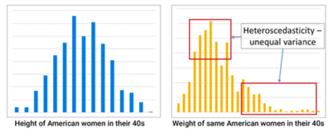
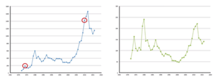
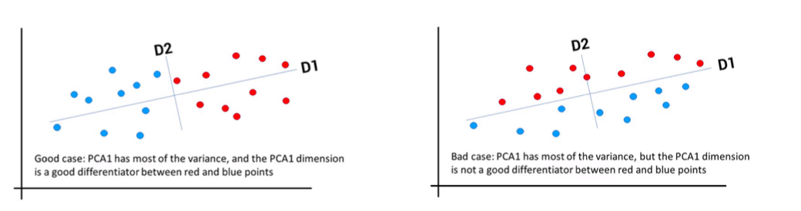

# Module 9 - Data Preparation and Principle Component Analysis (PCA)

Module 9 covers advanced data preparation techniques, 
including principal component analysis.

## M9L1 - Box-Cox Transformations

*Lecture 1 - Box-Cox Transformations (3:46)*

- Transform data before using it
- Box-Cox transformation
  
### Normality Assumption

- Some models assume data is normally distributed
  - Results have bias when assumption is wrong

```{r, fig.show='hold', fig.cap="Normality Assumption", out.width="100%", fig.align='center', echo=FALSE}

```

### Dealing with Heteroscedasticity

**Box-Cox Transformation**

- Logarithmic transformation
  - Stretches out the smaller range to enlarge its variability
  - Shrinks the larger range to reduce its variability
- $t(y) = (y^{\lambda}-1)/\lambda$
  - $t(y)$ can become close to normal distribution
- Software can do it for you
  - Check whether you need the transformation (e.g., Q-Q plot)

### Summary

- Box-Cox: George Box and David Cox
- Box-Cox: Useful for transforming a response to eliminate heteroscedasticity

## M9L2 - Detrending

*Lecture 2 - Detrending (3:40)*
  
### Detrending Data

**Time series data:**

- Trend: increase or decrease of data over time
  - For example:
    - Price of gold over time

```{r, fig.show='hold', fig.cap="Detrending Data - Price of Gold Over Time",out.width="100%", fig.align='center', echo=FALSE}

```

**Detrending:**

- Response
- Predictors
- Factor-based model
  - Regression, SVM, etc.

### How to Detrend

- Factor-by-factor 
  - one-dimensional regression: $y = a_o + a_1x$
- For example - simple linear regression for gold prices
    - Price = -45,600 + 23.2 × Year
  - De-trended price = Actual price - (-45,600 + 23.2 x Year)

### Summary

- Detrending Approach
  - Simple
  - Works well to remove trend effects for time series data
  - Helpful in factor-based analysis

## M9L3 - Intro to Principal Component Analysis

*Lecture 3 - Intro to Principal Component Analysis (4:43)*

- Feature extraction
  - Principal Component Analysis (PCA)
  - For high-dimensional and correlated data

### Motivational Example

- Dealing with a model with a lot of facts
  - Which of them are the most important?
  
- Example:
  - Does the past performance of any particular stocks indicate how well the overall market will perform in the next day?
- Possible data sources
  - 6000+ securities
  - Focus on days without major external events
    - wars
    - terrorist attacks
    - election results
    - natural disasters
    - etc.

### Motivational Example - Potential Issues

- 6000+ predictors require many years of daily data
  - But underlying situation may have changed with time
    - Can we reduce the amount of data needed?
- High correlation between some of the predictors
  - Companies in the same sector tend to move together

**Address both issues via Principal Component Analysis (PCA)**

### Principal Component Analysis (PCA)

- PCA transforms data
  - Removes correlations within the data
  - Ranks coordinates by importance
  
- Concentrate on the first n principal components
  - Reduces effect of randomness
  - Earlier principal components are likely to have higher signal-to-noise ratio

### Summary

- Principal Component Analysis (PCA)
  - For high-dimensional and correlated data
  - PCA attempts to remove these correlations, and rank coordinates by importance
- Future
  - Math behind PCA
  
## M9L4 - Using Principal Component Analysis

*Lecture 4 - Using Principal Component Analysis (4:44)*
  
### Principle Component Analysis (PCA)

- $X$: Initial matrix of data
- $x_{ij}$ is the jth data factor of point $i$
  - Scale such that $\frac{1}{m}\sum_i x_{ij} = \mu_j = 0$
- Find all of the eigenvectors of $X^T X$
  - $V$: Matrix of eigenvectors (sorted by eigenvalue)
  - $V = [V_1, V_2, \dots]$, where $V_j$ is the jth eigenvector of $X^T X$
- PCA - Linear Transformation
  - First component is $XV_1$, second is $XV_2$, etc.
  - kth new factor value for the ith data point: $t_{ik}=\sum_{j=1}^m x_{ij} v_{jk}$

### PCA - Linear Transformation

- PCA eliminates correlation between factors
- Want fewer variables in your model?
  - Only include the first $n$ principal components
- Our math assumed we were looking for a linear transformation
- Dealing with nonlinear functions
  - Using Kernels
  - Similar to SVM modeling

### PCA - Regression

Interpret the new model in terms of original factors

Example (Regression): PCA finds new L factors \{$t_{ik}$\}, then regression finds 
coefficients $b_0, b_1, \dots, b_L$

\begin{equation}
  \begin{split}
      y_i &= b_0 + \sum_{k=1}^L b_k t_ik  \\
      &= b_0 + \sum_{k=1}^L b_k [\sum_{j=1}^m x_{ij} v_{jk}] \\
      &= b_0 + \sum_{j=1}^m x_{ij} [\sum_{k=1}^L b_k v_{jk}]\\
      &= b_0 + \sum_{j=1}^m x_{ij} [a_j]
  \end{split}
  (\#eq:pca-regression)
\end{equation}

Implied regression coefficient for $x_j$:
\begin{equation}
  a_j = \sum^L_{k=1} b_k v_{jk}
(\#eq:regression-coeff)
\end{equation}

### Summary

- Principal Component Analysis (PCA)
  - For high-dimensional and correlated data
  - PCA attempts to remove these correlations, and rank coordinates by importance
  - PCA can be explained over the original factor space

## M9L5 - Eigenvalues and Eigenvectors

*Lecture 5 - Eigenvalues and Eigenvectors (2:09)*
  
### Eigenvalues and Eigenvectors

A: Square Matrix

- $v$: Vector such that $Av = \lambda v$
- $v$: Eigenvector of A
- $\lambda$: Eigenvalue of A
  - $\det(A-\lambda I) = 0$
- Given $\lambda$, solve $Av = \lambda v$ to find corresponding eigenvalue $v$

### Principle Component Analysis (PCA)

Scaled matrix $X$ of data

- $x_{ij} =$ jth value for data point $i$, after scaling

Find eigenvectors $v_1 \dots v_n$ of $(X^T X)$

Find the principal components

- Multiply $X$ by the eigenvectors
- $Xv_1, Xv_2, \dots Xv_n$ are the principal components
  - Transformed set of orthogonal coordinate directions

### Summary

- Finding eigenvalues and eigenvectors of a square matrix
- Application to Principal Component Analysis (PCA)

## M9L6 - PCA: The Good and Bad

*Lecture 6 - PCA: The Good and Bad (3:11)*
  
### PCA Review

- Change of coordinates
  - Create uncorrelated factors
  - Sorted by amount of variability explained
  
- Allows the use of small(er) number of variables
  - Usually pick the ones that explain the most variability

### Example: PCA is Good

```{r, fig.show='hold', fig.cap="Example: Good PCA",out.width="100%", fig.align='center', echo=FALSE}
knitr::include_graphics("figures/m9-pca-good.png")
```

### Example: PCA Can Also Be Bad

```{r, fig.show='hold', fig.cap="Example: Bad PCA",out.width="100%", fig.align='center', echo=FALSE}

```

### Summary

- Sometimes PCA can be good
- Sometimes PCA can be bad
- Often it can be a helpful approach to try